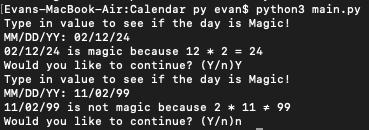

# Magic Dates

This project aims to tell you if a date is magic or not. A date is considered magic if the day and month multiply to equal the year.
Example:
>February 12th, 1924 is magic because 2 * 12 = 24

>November 2nd, 1999 is not magic because 11 * 2 ≠ 99

The datetime module is added ot verify first that the date is a valid date. The month and day is then multipied and compared to the year to give the correct output. A prompt is given to the user to continue. Screenshot is included below.

