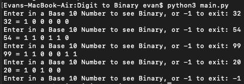

# Decimal to Binary

This project's goal is to have the user enter a decimal number, and convert it to binary. The conversion was done using recursion. A list was used to append the bits to the binary number as they were computed, since I could keep them in order all together. Screenshot below for the use of the program.

