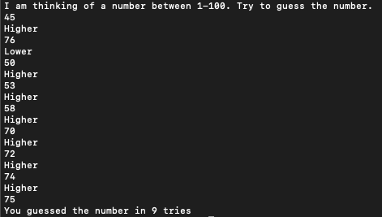

# HighLow

This is the first project of the class. The goal of the program is to simulate a number guessing game.

A number is generated between 1-100, and then the user types in numbers until the correct number is guessed. A guess is given with a response then given on whether or not the number in question is higher or lower than the guess. For example:

> I am thinking of a number between 1 and 100. Try to guess the number.
> 35
> Higher

The best strategy would be implementing a binary search for the number, giving you the chance to guess the number with a max of 7 guesses, although the game does not care as shown in the screenshot below

